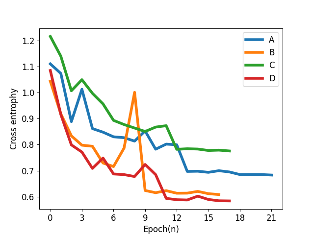

# End2End sound localization model

This is a fork of bingo-todd's repository trying to replicate the results of the following paper: *P. Vecchiotti, N. Ma, S. Squartini, and G. J. Brown,  “End-to-end binaural sound localisation from the raw waveform,”  in 2019 IEEE International Conference on Acoustics, Speech and Signal Processing (ICASSP), Brighton, UK, 2019, pp. 451–455.*

**Only WaveLoc-GTF is implemented**, which is one of the two models proposed in the paper.

bingo-todd reported slightly different results from those presented in the paper (see below). This fork also includes some very minor changes with respect to bingo-todd's version, which were necessary to make the code run correctly, as well as a fix for a bug where the training dataset leaked in some cases.

The results obtained here are slightly different from those reported by bingo-todd. This could be due to the minor code changes, but, given how small the changes are, it could also be due to differences in the architecture used for training.

## Model


## Requirements

You need:

- Python 3.7
- BasicTools (in bingo-todd's other [repository](https://github.com/bingo-todd/BasicTools)) (included here as submodule)
- A number of dependencies included in the requirements.txt file (e.g., TensorFlow 1.14, pysofar etc)
- To train and evaluate you need:
  - A copy of the TIMIT dataset (you have to secure this yourself)
  - The Surrey RealRoomBRIRs dataset (included here as submodule)

## Installation

Download this repository recursively: 

``` bash
git clone --recursive https://github.com/enzodesena/WaveLoc.git
cd WaveLoc
```

#### Start Docker (Apple Silicon users only)

If you haven't already done so already, install Docker (you will need [Homebrew](https://brew.sh/) installed to be able to run this):

```bash
brew install --cask docker
open -a docker
```

Then start a Docker container using Python 3.7 (make sure you are within the WaveLoc folder):

```bash
docker run --platform linux/amd64 -it --rm \
  -v "$PWD":/work \
  -w /work \
  python:3.7-bullseye bash
```

#### Download the data and extract TIMIT

Obtain the [TIMIT](https://catalog.ldc.upenn.edu/LDC93S1) dataset and unzip it into `WaveLoc/data/external/darpa-timit-acousticphonetic-continuous-speech` in such a way that the files are for instance in `WaveLoc/data/external/darpa-timit-acousticphonetic-continuous-speech/data/Test/DR1/...` .

#### Install dependencies

```bash
apt-get update
apt-get install -y pkg-config libhdf5-dev libnetcdf-dev gcc g++ gfortran
conda create -n waveloc python=3.7 	# Not needed if using docker
conda activate waveloc 							# Not needed if using docker
pip install -r requirements.txt
```

#### Generating dataset and training model 

```bash
(cd gen_dataset && ./run.sh)  # This takes a few hours
python train_mct.py           # This also takes a few hours
```

## Training

### Dataset

- BRIR

  Surrey binaural room impulse response (BRIR) database, including anechoic room and 4 reverberation room.

  <table style='text-align:center'>
  <tr>
    <td>Room</td> <td>A</td> <td>B</td> <td>C</td> <td>D</td>
  </tr>
  <tr>
    <td>RT_60(s)</td> <td>0.32</td> <td>0.47</td> <td>0.68</td> <td>0.89</td>
  </tr>
  <tr>
    <td>DDR(dB)</td> <td>6.09</td> <td>5.31</td> <td>8.82</td> <td>6.12</td>
  </tr>
  </table>

- Sound source (TIMIT database) sentences per azimuth

  <table style='text-align:center'>
  <col width=15%>
  <col width=15%>
  <col width=15%>
    <tr>
      <td>Train</td> <td>Validate</td> <td>Evaluate</td>
    </tr>
    <tr>
      <td>24</td> <td>6</td> <td>15</td>
    </tr>
  </table>


## Multi-conditional training(MCT)

For each reverberant room, the rest 3 reverberant rooms and anechoic room are used for training

Training curves

  <div align=center>
  
  </div>


## Evaluation

Root mean square error(RMSE) is used as the metrics of performance. For each reverberant room, the evaluation was performed 3 times to get more stable results and the test dataset was regenerated each time.

Since binaural sound is directly fed to models without extra preprocess and there may be short pulses in speech, the localization result was reported based on chunks rather than frames. Each chunk consisted of 25 consecutive frames.

### Paper results vs original 

<table style='text-align:center'>
<col width=30%>
<col width=15%>
<col width=15%>
<col width=15%>
<col width=15%>
  <tr>
    <th>Reverberant room</th> <th>A</th> <th>B</th> <th>C</th> <th>D</th>
   </tr>
   <tr>
   <th>Results of this repository</th> <td>1.7</td> <td>2.0</td> <td>1.0</td> <td>2.7</td>
   </tr>
   <tr>
   <th>Bingo Todd's result</th> <td>1.5</td> <td>2.0</td> <td>1.4</td> <td>2.7</td>
   </tr>
   <tr>
   <th>Result in paper</th> <td>1.5</td> <td>3.0</td> <td>1.7</td> <td>3.5</td>
   </tr>
</table>
